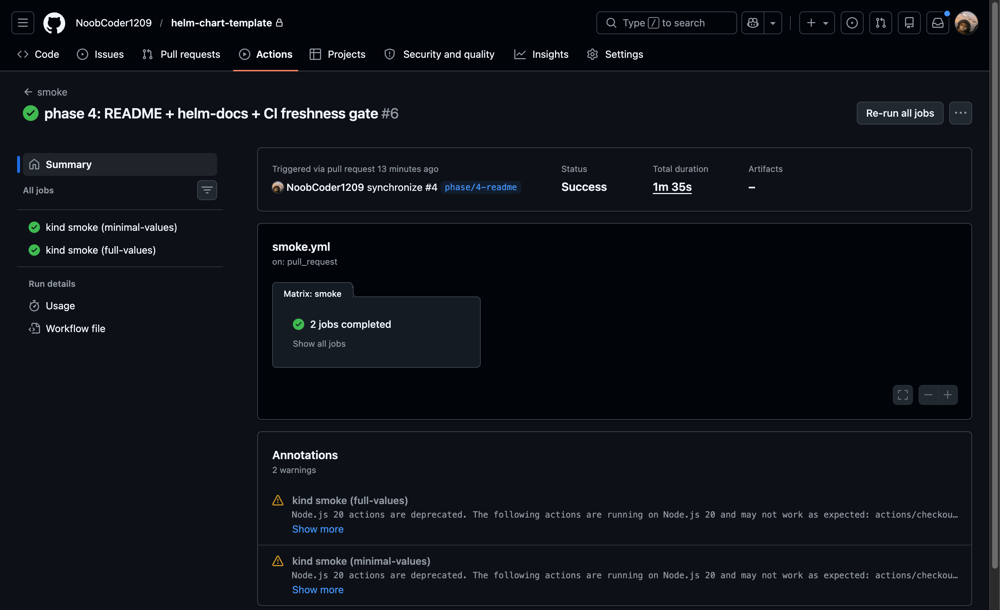

# helm-chart-template — Production-shaped Helm chart starter

[](https://github.com/NoobCoder1209/helm-chart-template/actions/workflows/lint.yml)
[](https://github.com/NoobCoder1209/helm-chart-template/actions/workflows/smoke.yml)



  

The chart deploys a stateless HTTP service (defaults to [`hashicorp/http-echo`](https://hub.docker.com/r/hashicorp/http-echo)) with the manifests you'd actually want in production — non-root + read-only-root-fs `securityContext`, pinned image tag, startup/liveness/readiness probes, HPA, PDB, NetworkPolicy, optional Ingress, optional ExternalSecret, default soft pod-anti-affinity, and a JSON schema that fails fast on bad values.

## What it shows

- A complete, production-shaped Helm chart structured the way Bitnami / Grafana / ingress-nginx structure theirs.
- `values.schema.json` (draft-07) catching `--set replicaCount=foo`, enum violations, typos at the root, and PDB `maxUnavailable`/`minAvailable` mutual-exclusion at install time.
- An External Secrets Operator path (`external-secrets.io/v1`) gated behind `externalSecrets.enabled`, mutually exclusive with the plain `Secret`.
- A NetworkPolicy default-deny posture with `ingressFrom`/`extraIngress` extension hooks.
- CI that runs `helm lint`, renders + `kubeconform -strict`, runs `kube-linter`, and stands up a kind 1.28 cluster to `helm install`/`helm test` against every matrix entry on every PR.
- An OCI release workflow that publishes the chart to GHCR on `vX.Y.Z` tags.

## Skills demonstrated

Helm · Kubernetes · GitOps · Production manifests · GitHub Actions · Chart Testing · kubeconform · kube-linter · External Secrets Operator · OCI registries · JSON Schema (draft-07)

## Quick start

```sh
# Local install from this directory:
helm install demo . --namespace demo --create-namespace
helm test demo --namespace demo

# Or pull from GHCR (requires a published release):
helm install demo oci://ghcr.io/noobcoder1209/charts/http-echo \
  --version 0.1.0 \
  --namespace demo --create-namespace
```

Try the schema:

```sh
helm template demo . --set replicaCount=foo
# Error: at '/replicaCount': got string, want integer
```

## Releasing

```sh
# Bump Chart.yaml `version:`, commit, then:
git tag v0.1.0
git push origin v0.1.0
# release.yml verifies the tag matches Chart.yaml and pushes the chart
# to oci://ghcr.io/<owner>/charts on GHCR.
```

## ExternalSecrets

Flip `externalSecrets.enabled=true` and provide a `secretStoreRef`:

```sh
helm install demo . \
  --set externalSecrets.enabled=true \
  --set externalSecrets.secretStoreRef.name=my-store \
  --set 'externalSecrets.remoteRefs[0].secretKey=DEMO_VALUE' \
  --set 'externalSecrets.remoteRefs[0].remoteRef.key=prod/http-echo' \
  --set 'externalSecrets.remoteRefs[0].remoteRef.property=demo_value'
```

The plain `Secret` template stops rendering automatically — the chart enforces "one source of secret data, never both".

## Verification

The chart is gated by five layers, four of which run in CI on every PR (`lint.yml` and `smoke.yml`):

- **`helm lint .`** — chart structure, schema parse errors.
- **`helm template . | kubeconform -strict -kubernetes-version 1.28.0`** — invalid Kubernetes manifests.
- **`helm template . | kube-linter lint -`** — PDB without `unhealthyPodEvictionPolicy`, missing anti-affinity, unset resource requirements, latest-tag, default ServiceAccount, etc.
- **`kind` + `helm install --wait` + `helm test`** — real apply, real probes, real connectivity.
- **`values.schema.json`** — type errors, enum violations, mutex violations on `--set`.

## Requirements

Kubernetes: `>=1.28.0-0`

## Values

| Key | Type | Default | Description |
|-----|------|---------|-------------|
| affinity | object | `{}` | Pod affinity. When empty, the chart synthesizes a soft pod-anti-affinity rule (preferred, weight 100) that spreads replicas across nodes by hostname, using the chart's selectorLabels — so it stays correct under `nameOverride`. Set to `{ }` (the default) to use the synthesized rule, or provide a full affinity spec to override entirely. |
| args | list | `["-text=hello from helm-chart-template","-listen=:5678"]` | Args passed to the http-echo binary. Default echoes a string on /. |
| autoscaling.behavior | object | `{}` | Optional `behavior` block (HPA v2). Empty by default. |
| autoscaling.enabled | bool | `false` | Enable HorizontalPodAutoscaler. When true, replicaCount is ignored. |
| autoscaling.maxReplicas | int | `10` |  |
| autoscaling.minReplicas | int | `2` |  |
| autoscaling.targetCPUUtilizationPercentage | int | `75` | Target average CPU utilization percentage. Set to null to disable. |
| autoscaling.targetMemoryUtilizationPercentage | int | `80` | Target average memory utilization percentage. Set to null to disable. |
| configMap.data | object | `{}` | Key/value map of environment variables. |
| configMap.enabled | bool | `false` |  |
| env | list | `[]` | Extra environment variables on the container (beyond envFrom). |
| externalSecrets.creationPolicy | string | `"Owner"` | Owner | Orphan | Merge | None. |
| externalSecrets.dataFrom | list | `[]` | Bulk references (e.g. `extract:` or `find:`). |
| externalSecrets.enabled | bool | `false` | Render an ExternalSecret instead of a plain Secret. Requires the External Secrets Operator (https://external-secrets.io) and a configured SecretStore. |
| externalSecrets.refreshInterval | string | `"1h"` | Refresh interval for the ExternalSecret. |
| externalSecrets.remoteRefs | list | `[]` | Per-key references. |
| externalSecrets.secretStoreRef.kind | string | `"SecretStore"` | SecretStore (namespaced) or ClusterSecretStore. |
| externalSecrets.secretStoreRef.name | string | `""` | Required when externalSecrets.enabled=true. |
| extraVolumeMounts | list | `[]` | Extra volume mounts (in addition to /tmp). |
| extraVolumes | list | `[]` | Extra volumes (in addition to the emptyDir for /tmp). |
| fullnameOverride | string | `""` | Override the full resource name (release-name + chart name) entirely. |
| image.pullPolicy | string | `"IfNotPresent"` | Image pull policy. |
| image.repository | string | `"hashicorp/http-echo"` | Container image repository. |
| image.tag | string | `"0.2.3"` | Image tag. Pinned to a specific version; do not use "latest" in production. |
| imagePullSecrets | list | `[]` | Image pull secrets, e.g. `[{name: my-registry-secret}]`. |
| ingress.annotations | object | `{}` | Annotations on the Ingress. |
| ingress.className | string | `"nginx"` | IngressClass name. Leave empty to omit `ingressClassName`. |
| ingress.enabled | bool | `false` | Enable Ingress object. |
| ingress.hosts | list | `[{"host":"chart-example.local","paths":[{"path":"/","pathType":"Prefix"}]}]` | Hosts and paths. |
| ingress.tls | list | `[]` | TLS config, e.g. `[{secretName: chart-example-tls, hosts: [chart-example.local]}]`. |
| nameOverride | string | `""` | Override the chart name in resource names. |
| networkPolicy.egressTo | list | `[]` | Extra `egress.to` peers appended to the kube-dns rule. Same caveat as `ingressFrom` — for distinct ports use `extraEgress`. |
| networkPolicy.enabled | bool | `false` | Enable a default-deny NetworkPolicy that allows same-namespace ingress and kube-dns egress. |
| networkPolicy.extraEgress | list | `[]` | Additional, fully-formed egress rules. |
| networkPolicy.extraIngress | list | `[]` | Additional, fully-formed ingress rules (each with its own `from` and `ports`). |
| networkPolicy.ingressFrom | list | `[]` | Extra `ingress.from` peers appended to the same rule that targets the service port. Use for additional same-port sources (e.g. specific namespaceSelectors). Use `extraIngress` for rules that target other ports. |
| nodeSelector | object | `{}` |  |
| podAnnotations | object | `{}` | Extra annotations on every Pod. |
| podDisruptionBudget.enabled | bool | `true` | Enable a PodDisruptionBudget. Skipped when replicaCount=1. |
| podDisruptionBudget.maxUnavailable | int | `1` | Maximum unavailable pods during voluntary disruption. |
| podDisruptionBudget.minAvailable | string | `nil` | Minimum available pods. Mutually exclusive with maxUnavailable. |
| podDisruptionBudget.unhealthyPodEvictionPolicy | string | `"AlwaysAllow"` | Eviction policy for unhealthy pods. AlwaysAllow lets unhealthy pods be evicted regardless of the budget; IfHealthyBudget blocks until the budget is met. AlwaysAllow is the safe default for stateless services. |
| podLabels | object | `{}` | Extra labels on every Pod. |
| podSecurityContext.fsGroup | int | `65532` |  |
| podSecurityContext.runAsGroup | int | `65532` |  |
| podSecurityContext.runAsNonRoot | bool | `true` |  |
| podSecurityContext.runAsUser | int | `65532` |  |
| podSecurityContext.seccompProfile.type | string | `"RuntimeDefault"` |  |
| priorityClassName | string | `""` | Pod priorityClassName. Empty string omits the field. |
| probes.liveness.enabled | bool | `true` |  |
| probes.liveness.failureThreshold | int | `5` |  |
| probes.liveness.httpGet.path | string | `"/"` |  |
| probes.liveness.httpGet.port | string | `"http"` |  |
| probes.liveness.periodSeconds | int | `10` |  |
| probes.liveness.timeoutSeconds | int | `1` |  |
| probes.readiness.enabled | bool | `true` |  |
| probes.readiness.failureThreshold | int | `3` |  |
| probes.readiness.httpGet.path | string | `"/"` |  |
| probes.readiness.httpGet.port | string | `"http"` |  |
| probes.readiness.periodSeconds | int | `10` |  |
| probes.readiness.timeoutSeconds | int | `1` |  |
| probes.startup.enabled | bool | `true` |  |
| probes.startup.failureThreshold | int | `30` |  |
| probes.startup.httpGet.path | string | `"/"` |  |
| probes.startup.httpGet.port | string | `"http"` |  |
| probes.startup.periodSeconds | int | `10` |  |
| probes.startup.timeoutSeconds | int | `1` |  |
| replicaCount | int | `2` | Number of replicas. Ignored when autoscaling.enabled=true. |
| resources.limits.cpu | string | `"200m"` |  |
| resources.limits.memory | string | `"128Mi"` |  |
| resources.requests.cpu | string | `"50m"` |  |
| resources.requests.memory | string | `"64Mi"` |  |
| revisionHistoryLimit | int | `5` |  |
| secret.data | object | `{}` | Pre-base64-encoded values. |
| secret.enabled | bool | `false` |  |
| secret.stringData | object | `{}` | Plaintext values (Helm encodes them). |
| securityContext.allowPrivilegeEscalation | bool | `false` |  |
| securityContext.capabilities.drop[0] | string | `"ALL"` |  |
| securityContext.readOnlyRootFilesystem | bool | `true` |  |
| securityContext.runAsNonRoot | bool | `true` |  |
| securityContext.runAsUser | int | `65532` |  |
| service.annotations | object | `{}` | Annotations on the Service. |
| service.port | int | `80` | Service port (cluster-side). |
| service.targetPort | int | `5678` | Container port the Service forwards to. http-echo listens on 5678. |
| service.type | string | `"ClusterIP"` | Service type. |
| serviceAccount.annotations | object | `{}` | Annotations on the ServiceAccount (e.g. for IRSA / Workload Identity). |
| serviceAccount.automount | bool | `true` | Whether the ServiceAccount token is automounted. |
| serviceAccount.create | bool | `true` | Whether to create a dedicated ServiceAccount. |
| serviceAccount.name | string | `""` | Override the ServiceAccount name. When empty, uses the chart fullname. |
| terminationGracePeriodSeconds | int | `30` |  |
| tolerations | list | `[]` |  |
| topologySpreadConstraints | list | `[]` |  |

## License

MIT — see [`LICENSE`](./LICENSE).

---

----------------------------------------------
Autogenerated from chart metadata using [helm-docs v1.14.2](https://github.com/norwoodj/helm-docs/releases/v1.14.2)
